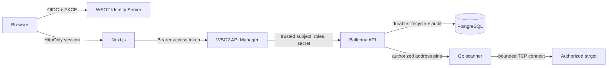
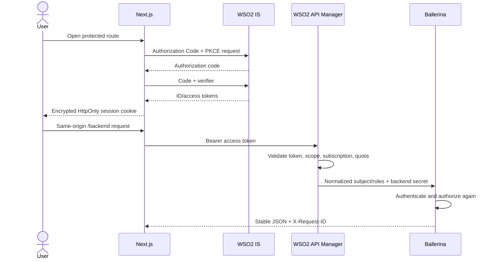
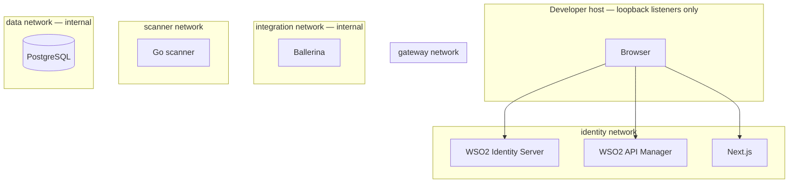

# SecureScan architecture, login, and deployment diagrams

These diagrams complement the maintained
[architecture description](architecture-v1.md). They show security boundaries,
not a promise that the pending Docker/WSO2 evidence has already passed.

## System architecture

API Manager is the public API policy boundary. Ballerina repeats identity,
role, ownership, input, target-policy, and job-limit enforcement. Go performs
the final DNS-set and address-safety check before network access.

## Login and API request flow

The normal browser client requests `securescan:scan`. A separate privileged
browser client is selected only for the safe `/admin` login destination and
requests `securescan:scan` plus `securescan:admin`. The selected client is
bound into the encrypted OIDC transaction. API Manager and Ballerina still
require the administrator scope and exact administrator role independently.

## Compose deployment

PostgreSQL, Ballerina, and Go are not published on the host. Network isolation
reduces accidental reachability but does not replace application controls.
