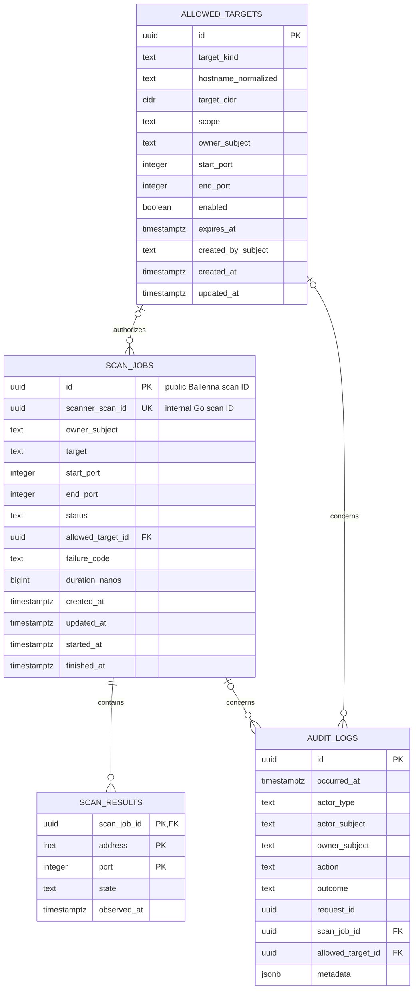

# SecureScan PostgreSQL Schema Design

Status: Day 13 implementation; the Day 11 schema/index foundation is executable,
and Ballerina now persists scan lifecycle and results transactionally with
owner-scoped, deterministic reads.

## Design goals

This schema makes PostgreSQL the durable system of record for a user's scan
request, the individual address/port observations, allowlist decisions, and
security audit events. WSO2 remains the identity system and the Go scanner
remains an internal execution service. The database stores immutable identity
subjects and correlation identifiers, but never OAuth/OIDC tokens, API keys,
cookies, scanner credentials, or connection strings.

The design assumes PostgreSQL 14 or later. UUIDs are generated by the calling
service with a cryptographically secure UUID v4 implementation; database
defaults are deliberately omitted so ownership of ID creation is explicit.
All timestamps are `timestamptz`, written in UTC by services and interpreted as
absolute instants by PostgreSQL.

## Schema diagram



`scan_results` uses the natural key `(scan_job_id, address, port)`: a hostname
can resolve to several addresses and the same port must be retained for each
one. No standalone result ID is needed.

## Implemented logical DDL

This documents the schema implemented by the Day 11 V001 and V002 migrations
and consumed by the Day 12/13 Ballerina persistence layer.

```sql
CREATE TABLE allowed_targets (
    id                  uuid PRIMARY KEY,
    target_kind         text NOT NULL,
    hostname_normalized text,
    target_cidr         cidr,
    scope               text NOT NULL DEFAULT 'GLOBAL',
    owner_subject       text,
    start_port          integer,
    end_port            integer,
    enabled             boolean NOT NULL DEFAULT true,
    expires_at          timestamptz,
    created_by_subject  text NOT NULL,
    created_at          timestamptz NOT NULL DEFAULT CURRENT_TIMESTAMP,
    updated_at          timestamptz NOT NULL DEFAULT CURRENT_TIMESTAMP,

    CONSTRAINT allowed_targets_kind_ck
        CHECK (target_kind IN ('HOSTNAME', 'CIDR')),
    CONSTRAINT allowed_targets_value_ck CHECK (
        (target_kind = 'HOSTNAME'
            AND hostname_normalized IS NOT NULL
            AND target_cidr IS NULL
            AND hostname_normalized = lower(hostname_normalized)
            AND hostname_normalized = btrim(hostname_normalized)
            AND length(hostname_normalized) BETWEEN 1 AND 253)
        OR
        (target_kind = 'CIDR'
            AND hostname_normalized IS NULL
            AND target_cidr IS NOT NULL)
    ),
    CONSTRAINT allowed_targets_scope_ck
        CHECK (scope IN ('GLOBAL', 'OWNER')),
    CONSTRAINT allowed_targets_owner_ck CHECK (
        (scope = 'GLOBAL' AND owner_subject IS NULL)
        OR (scope = 'OWNER' AND owner_subject IS NOT NULL
            AND length(owner_subject) BETWEEN 1 AND 255)
    ),
    CONSTRAINT allowed_targets_ports_ck CHECK (
        (start_port IS NULL AND end_port IS NULL)
        OR (start_port IS NOT NULL
            AND end_port IS NOT NULL
            AND start_port BETWEEN 1 AND 65535
            AND end_port BETWEEN 1 AND 65535
            AND start_port <= end_port)
    ),
    CONSTRAINT allowed_targets_creator_ck
        CHECK (length(created_by_subject) BETWEEN 1 AND 255),
    CONSTRAINT allowed_targets_expiry_ck
        CHECK (expires_at IS NULL OR expires_at > created_at)
);

-- NULL-safe uniqueness is expressed with partial indexes for PostgreSQL 14.
CREATE UNIQUE INDEX allowed_targets_global_hostname_uq
    ON allowed_targets (hostname_normalized, COALESCE(start_port, 0),
                        COALESCE(end_port, 0))
    WHERE scope = 'GLOBAL' AND target_kind = 'HOSTNAME';
CREATE UNIQUE INDEX allowed_targets_owner_hostname_uq
    ON allowed_targets (owner_subject, hostname_normalized,
                        COALESCE(start_port, 0), COALESCE(end_port, 0))
    WHERE scope = 'OWNER' AND target_kind = 'HOSTNAME';
CREATE UNIQUE INDEX allowed_targets_global_cidr_uq
    ON allowed_targets (target_cidr, COALESCE(start_port, 0),
                        COALESCE(end_port, 0))
    WHERE scope = 'GLOBAL' AND target_kind = 'CIDR';
CREATE UNIQUE INDEX allowed_targets_owner_cidr_uq
    ON allowed_targets (owner_subject, target_cidr,
                        COALESCE(start_port, 0), COALESCE(end_port, 0))
    WHERE scope = 'OWNER' AND target_kind = 'CIDR';

CREATE TABLE scan_jobs (
    id                  uuid PRIMARY KEY,
    scanner_scan_id     uuid UNIQUE,
    owner_subject       text NOT NULL,
    target              text NOT NULL,
    start_port          integer NOT NULL,
    end_port            integer NOT NULL,
    status              text NOT NULL,
    allowed_target_id   uuid REFERENCES allowed_targets(id) ON DELETE SET NULL,
    failure_code        text,
    duration_nanos      bigint,
    created_at          timestamptz NOT NULL DEFAULT CURRENT_TIMESTAMP,
    updated_at          timestamptz NOT NULL DEFAULT CURRENT_TIMESTAMP,
    started_at          timestamptz,
    finished_at         timestamptz,

    CONSTRAINT scan_jobs_owner_ck
        CHECK (length(owner_subject) BETWEEN 1 AND 255),
    CONSTRAINT scan_jobs_target_ck
        CHECK (length(btrim(target)) BETWEEN 1 AND 253),
    CONSTRAINT scan_jobs_ports_ck CHECK (
        start_port BETWEEN 1 AND 65535
        AND end_port BETWEEN 1 AND 65535
        AND start_port <= end_port
    ),
    CONSTRAINT scan_jobs_status_ck CHECK (
        status IN ('QUEUED', 'RUNNING', 'COMPLETED', 'FAILED', 'BLOCKED')
    ),
    CONSTRAINT scan_jobs_failure_ck CHECK (
        (status IN ('FAILED', 'BLOCKED') AND failure_code IS NOT NULL)
        OR (status NOT IN ('FAILED', 'BLOCKED') AND failure_code IS NULL)
    ),
    CONSTRAINT scan_jobs_timeline_ck CHECK (
        updated_at >= created_at
        AND (started_at IS NULL OR started_at >= created_at)
        AND (finished_at IS NULL OR finished_at >= created_at)
        AND (finished_at IS NULL OR started_at IS NULL
             OR finished_at >= started_at)
        AND (status = 'QUEUED' AND started_at IS NULL
                                 AND finished_at IS NULL
             OR status = 'RUNNING' AND started_at IS NOT NULL
                                 AND finished_at IS NULL
             OR status = 'COMPLETED' AND started_at IS NOT NULL
                                   AND finished_at IS NOT NULL
             OR status = 'FAILED' AND finished_at IS NOT NULL
             OR status = 'BLOCKED' AND started_at IS NULL
                                 AND finished_at IS NOT NULL)
    ),
    CONSTRAINT scan_jobs_scanner_id_ck CHECK (
        status NOT IN ('RUNNING', 'COMPLETED') OR scanner_scan_id IS NOT NULL
    ),
    CONSTRAINT scan_jobs_blocked_ck CHECK (
        status <> 'BLOCKED'
        OR (scanner_scan_id IS NULL AND allowed_target_id IS NULL)
    ),
    CONSTRAINT scan_jobs_duration_ck CHECK (
        (status = 'COMPLETED' AND duration_nanos IS NOT NULL
                              AND duration_nanos >= 0)
        OR (status <> 'COMPLETED' AND duration_nanos IS NULL)
    )
);

CREATE TABLE scan_results (
    scan_job_id uuid NOT NULL
        REFERENCES scan_jobs(id) ON DELETE CASCADE,
    address     inet NOT NULL,
    port        integer NOT NULL,
    state       text NOT NULL,
    observed_at timestamptz NOT NULL DEFAULT CURRENT_TIMESTAMP,

    PRIMARY KEY (scan_job_id, address, port),
    CONSTRAINT scan_results_port_ck CHECK (port BETWEEN 1 AND 65535),
    CONSTRAINT scan_results_state_ck CHECK (state IN ('OPEN', 'CLOSED'))
);

CREATE TABLE audit_logs (
    id                uuid PRIMARY KEY,
    occurred_at       timestamptz NOT NULL DEFAULT CURRENT_TIMESTAMP,
    actor_type        text NOT NULL,
    actor_subject     text,
    owner_subject     text,
    action            text NOT NULL,
    outcome           text NOT NULL,
    request_id        uuid,
    scan_job_id       uuid REFERENCES scan_jobs(id) ON DELETE SET NULL,
    allowed_target_id uuid REFERENCES allowed_targets(id) ON DELETE SET NULL,
    metadata          jsonb NOT NULL DEFAULT '{}'::jsonb,

    CONSTRAINT audit_logs_actor_type_ck
        CHECK (actor_type IN ('USER', 'ADMIN', 'SERVICE', 'SYSTEM')),
    CONSTRAINT audit_logs_actor_ck CHECK (
        (actor_type = 'SYSTEM' AND actor_subject IS NULL)
        OR (actor_type <> 'SYSTEM' AND actor_subject IS NOT NULL
            AND length(actor_subject) BETWEEN 1 AND 255)
    ),
    CONSTRAINT audit_logs_owner_ck CHECK (
        owner_subject IS NULL OR length(owner_subject) BETWEEN 1 AND 255
    ),
    CONSTRAINT audit_logs_action_ck CHECK (action IN (
        'SCAN_REQUESTED', 'SCAN_BLOCKED', 'SCAN_DISPATCHED',
        'SCAN_STARTED', 'SCAN_COMPLETED', 'SCAN_FAILED', 'SCAN_VIEWED',
        'ALLOW_TARGET_CREATED', 'ALLOW_TARGET_UPDATED',
        'ALLOW_TARGET_DISABLED'
    )),
    CONSTRAINT audit_logs_outcome_ck
        CHECK (outcome IN ('SUCCESS', 'DENIED', 'FAILURE')),
    CONSTRAINT audit_logs_metadata_object_ck
        CHECK (jsonb_typeof(metadata) = 'object')
);
```

The application must update `updated_at` explicitly in the same statement as
each mutation. A later migration may add a small `BEFORE UPDATE` trigger if
all writers cannot reliably do this; there is no hidden trigger in the Day 11
design.

### Indexes

Primary and unique constraints already index every public ID and the complete
result key. The V002 index migration adds:

```sql
-- User history and status polling.
CREATE INDEX scan_jobs_owner_created_idx
    ON scan_jobs (owner_subject, created_at DESC, id DESC);
CREATE INDEX scan_jobs_owner_status_created_idx
    ON scan_jobs (owner_subject, status, created_at DESC, id DESC);

-- Administrator history and bounded status/time-range filtering.
CREATE INDEX scan_jobs_created_idx
    ON scan_jobs (created_at DESC, id DESC);
CREATE INDEX scan_jobs_status_created_idx
    ON scan_jobs (status, created_at DESC, id DESC);

-- Dispatcher queue; small because terminal jobs are excluded.
CREATE INDEX scan_jobs_queued_idx
    ON scan_jobs (created_at, id) WHERE status = 'QUEUED';
CREATE INDEX scan_jobs_allowed_target_idx
    ON scan_jobs (allowed_target_id) WHERE allowed_target_id IS NOT NULL;

-- Open-port projection without indexing every closed result.
CREATE INDEX scan_results_open_idx
    ON scan_results (scan_job_id, port, address) WHERE state = 'OPEN';

-- Active allowlist lookup. B-tree supports exact hostnames; GiST supports
-- containment operators such as target_cidr >>= $address::inet.
CREATE INDEX allowed_targets_active_hostname_idx
    ON allowed_targets (hostname_normalized, scope, owner_subject)
    WHERE enabled AND target_kind = 'HOSTNAME';
CREATE INDEX allowed_targets_active_cidr_gist_idx
    ON allowed_targets USING gist (target_cidr inet_ops)
    WHERE enabled AND target_kind = 'CIDR';
CREATE INDEX allowed_targets_expiry_idx
    ON allowed_targets (expires_at) WHERE enabled AND expires_at IS NOT NULL;
CREATE INDEX allowed_targets_created_idx
    ON allowed_targets (created_at DESC, id DESC);

-- Investigation paths and foreign-key maintenance.
CREATE INDEX audit_logs_occurred_idx
    ON audit_logs (occurred_at DESC, id DESC);
CREATE INDEX audit_logs_action_occurred_idx
    ON audit_logs (action, occurred_at DESC, id DESC);
CREATE INDEX audit_logs_actor_occurred_idx
    ON audit_logs (actor_subject, occurred_at DESC, id DESC)
    WHERE actor_subject IS NOT NULL;
CREATE INDEX audit_logs_owner_occurred_idx
    ON audit_logs (owner_subject, occurred_at DESC, id DESC)
    WHERE owner_subject IS NOT NULL;
CREATE INDEX audit_logs_request_idx
    ON audit_logs (request_id, occurred_at) WHERE request_id IS NOT NULL;
CREATE INDEX audit_logs_scan_job_idx
    ON audit_logs (scan_job_id, occurred_at) WHERE scan_job_id IS NOT NULL;
CREATE INDEX audit_logs_allowed_target_idx
    ON audit_logs (allowed_target_id, occurred_at)
    WHERE allowed_target_id IS NOT NULL;
```

Indexes on all referencing foreign-key columns avoid expensive scans when a
parent row changes. Indexes should be validated with realistic
`EXPLAIN (ANALYZE, BUFFERS)` plans after Day 11 seed/load data exists. Avoid
adding a broad index on `scan_results.state`: the two-value column is not
selective.

## Status lifecycle

Database values are uppercase and have these meanings:

| Status | Meaning | Required database shape |
| --- | --- | --- |
| `QUEUED` | Persisted and eligible for dispatch | no start/finish; Go ID may still be null |
| `RUNNING` | Go accepted the job and execution began | Go ID and `started_at` present |
| `COMPLETED` | All observations committed | Go ID, start, finish, and duration present |
| `FAILED` | Dispatch or execution ended unsuccessfully | safe `failure_code` and finish present; Go ID/start may be absent |
| `BLOCKED` | Authorization/allowlist policy denied dispatch | safe `failure_code` and finish present; no Go ID or matched rule |

Allowed transitions are `QUEUED -> RUNNING -> COMPLETED|FAILED`,
`QUEUED -> FAILED`, and `QUEUED -> BLOCKED`. Terminal rows are immutable except
for an administrator's separately audited correction. The service enforces
the transition with a conditional update, for example:

```sql
UPDATE scan_jobs
SET status = 'RUNNING', scanner_scan_id = $2, started_at = $3, updated_at = $3
WHERE id = $1 AND status = 'QUEUED';
```

Zero updated rows means another worker won or the transition is illegal. The
Day 13 adapter exposes that outcome to callers. For completion it locks the
active job row, batch-inserts all `scan_results`, conditionally updates the job
to `COMPLETED`, and explicitly commits. Any error rolls the transaction back.
Once the first completion commits, a retry cannot lock the now-terminal job and
therefore cannot append or replace observations. This is the cross-table
guarantee that a completed job has its complete result set.

The current Go/Ballerina API uses lowercase `accepted`, `running`, `completed`,
and `failed`. The persistence adapter maps `accepted -> QUEUED` and uppercases
the remaining values. `BLOCKED` is decided before dispatch by Ballerina and has
no Go equivalent.

## Ballerina/Go scan-ID correlation

The two IDs have intentionally different domains:

- `scan_jobs.id` is created by Ballerina before any scanner call. It is the
  stable, public `scanId`, database primary key, and URL identifier.
- `scan_jobs.scanner_scan_id` is the UUID returned by Go's
  `POST /internal/scans`. It is unique, nullable until dispatch succeeds, and
  is used only for Ballerina-to-Go polling.
- `audit_logs.request_id` is the per-HTTP-request `X-Request-ID`. It correlates
  logs for one request and must not be used as either scan identifier.

On create, Ballerina persists `QUEUED`, calls Go, stores the returned Go ID,
and returns the Ballerina ID. On `GET /api/v1/scans/{scanId}`, Ballerina first
loads the owner-scoped row by `scan_jobs.id`; if synchronization is required,
it polls Go with `scanner_scan_id`. Re-dispatch after a provably failed request
may assign one Go ID only while the row is still `QUEUED`; the unique constraint
prevents two database jobs from claiming the same Go job. An ambiguous timeout
must not blindly create another scan: mark the job `FAILED` with a safe code or
reconcile by an idempotency mechanism added to the internal API.

During migration from today's in-memory API, existing behavior can be retained
for newly persisted jobs by returning the Ballerina ID only after the mapping
has been committed. No client should begin depending on the internal Go ID.

## Required query coverage

All service queries select named columns rather than `SELECT *`. `$subject` is
the immutable WSO2 `iss + sub` principal representation, not a display name or
email. Pagination uses `(created_at, id)` or `(occurred_at, id)` cursors so new
rows do not shift pages.

| Principal | Required query | Supporting key/index |
| --- | --- | --- |
| User | create a scan and audit it | `scan_jobs` PK; append-only `audit_logs` |
| User | retrieve one owned scan and all/open results | `scan_jobs` PK plus ownership predicate; result PK/open partial index |
| User | list owned history or active scans | owner/created and owner/status/created indexes |
| Service | authorize hostname and every resolved address | active hostname B-tree and active CIDR GiST indexes |
| Service | dispatch/reconcile and change status atomically | queued partial index, job PK, unique Go ID |
| Service | commit a complete result set | result PK/FK and conditional job update |
| Admin | list scans by owner, status, and time; inspect either ID | history indexes, job PK, unique Go ID |
| Admin | create/list/update/disable allowlist rules | allowlist unique and active lookup indexes |
| Admin | investigate by job, request, actor/owner, and time | audit job/request/actor/owner/time indexes |
| Admin | bounded operational status counts | status/time query over a required time window |

### User operations

Create a job, then write a sanitized audit event in the same transaction:

```sql
INSERT INTO scan_jobs
    (id, owner_subject, target, start_port, end_port, status,
     allowed_target_id)
VALUES ($1, $2, $3, $4, $5, 'QUEUED', $6)
RETURNING id, status, target, start_port, end_port, created_at;
```

Get one owned job and its results (the ownership predicate prevents an IDOR):

```sql
SELECT id, status, target, start_port, end_port, failure_code,
       duration_nanos, created_at, updated_at, started_at, finished_at
FROM scan_jobs
WHERE id = $1 AND owner_subject = $2;

SELECT address, port, state, observed_at
FROM scan_results
WHERE scan_job_id = $1
ORDER BY address, port;
```

The second query runs only if the first returned a row. Keeping it separate
avoids repeating job data once per result and is not an N+1 pattern: it is a
fixed two-query batch for one job. For the common open-port view, add
`AND state = 'OPEN'`.

List a user's history or active jobs:

```sql
SELECT id, status, target, start_port, end_port, created_at, updated_at
FROM scan_jobs
WHERE owner_subject = $1
  AND ($2::text IS NULL OR status = $2)
  AND (created_at, id) < ($3::timestamptz, $4::uuid)
ORDER BY created_at DESC, id DESC
LIMIT $5;
```

The first page omits the cursor predicate rather than passing sentinel values.
For active jobs use `status IN ('QUEUED', 'RUNNING')` and the
`scan_jobs_owner_status_created_idx` index.

### Allowlist decision

Ballerina normalizes a DNS name to lowercase without a trailing dot, resolves
it using the existing SSRF-safe validation path, and requires both the name
and every resolved address to pass policy. Exact hostname lookup is:

```sql
SELECT id, scope, start_port, end_port
FROM allowed_targets
WHERE enabled
  AND target_kind = 'HOSTNAME'
  AND hostname_normalized = $1
  AND (expires_at IS NULL OR expires_at > CURRENT_TIMESTAMP)
  AND (scope = 'GLOBAL' OR owner_subject = $2)
  AND (start_port IS NULL
       OR (start_port <= $3 AND end_port >= $4))
ORDER BY (scope = 'OWNER') DESC
LIMIT 1;
```

Run the following for each validated resolved address and reject the entire
request if any address has no match. `target_cidr >>= address` means the rule
contains the candidate address.

```sql
SELECT id, scope, start_port, end_port
FROM allowed_targets
WHERE enabled
  AND target_kind = 'CIDR'
  AND target_cidr >>= $1::inet
  AND (expires_at IS NULL OR expires_at > CURRENT_TIMESTAMP)
  AND (scope = 'GLOBAL' OR owner_subject = $2)
  AND (start_port IS NULL
       OR (start_port <= $3 AND end_port >= $4))
ORDER BY (scope = 'OWNER') DESC, masklen(target_cidr) DESC
LIMIT 1;
```

DNS is resolved and private/loopback/link-local/multicast/metadata addresses
are rejected before these queries. An allowlist record never overrides the
network safety policy. The selected `allowed_target_id` records the rule used;
for several resolved addresses the audit `metadata` may contain only their
non-sensitive matched rule IDs, while `scan_results.address` proves what was
actually scanned.

### Worker and administrator operations

Claim queue candidates without two dispatchers taking the same row:

```sql
SELECT id, target, start_port, end_port
FROM scan_jobs
WHERE status = 'QUEUED'
ORDER BY created_at, id
FOR UPDATE SKIP LOCKED
LIMIT $1;
```

This selection and a lease/dispatch strategy remains future worker work; no
network call should hold a database lock.

Administrators can list/filter all scans using `status`, `owner_subject`, and a
time range, ordered by `(created_at DESC, id DESC)`. Exact job lookup uses the
primary key; internal reconciliation uses the unique `scanner_scan_id` index.

```sql
SELECT id, scanner_scan_id, owner_subject, target, start_port, end_port,
       status, failure_code, created_at, updated_at, started_at, finished_at
FROM scan_jobs
WHERE ($1::text IS NULL OR owner_subject = $1)
  AND ($2::text IS NULL OR status = $2)
  AND created_at >= $3 AND created_at < $4
  AND (created_at, id) < ($5::timestamptz, $6::uuid)
ORDER BY created_at DESC, id DESC
LIMIT $7;

SELECT id, owner_subject, status, target, start_port, end_port,
       scanner_scan_id, failure_code, duration_nanos,
       created_at, updated_at, started_at, finished_at
FROM scan_jobs
WHERE id = $1;

SELECT id, owner_subject, status, target, start_port, end_port,
       created_at, updated_at
FROM scan_jobs
WHERE scanner_scan_id = $1;
```

As with user pagination, the first admin page omits its cursor predicate.
Optional-filter queries can use custom plans or purpose-built query variants
when `EXPLAIN` shows generic-plan regressions. Audit investigations are
supported by these bounded queries:

```sql
SELECT occurred_at, actor_type, actor_subject, owner_subject, action, outcome,
       request_id, scan_job_id, allowed_target_id, metadata
FROM audit_logs
WHERE scan_job_id = $1
ORDER BY occurred_at, id;

SELECT occurred_at, actor_type, actor_subject, action, outcome,
       scan_job_id, metadata
FROM audit_logs
WHERE request_id = $1
ORDER BY occurred_at, id;

SELECT occurred_at, actor_type, actor_subject, action, outcome,
       request_id, scan_job_id
FROM audit_logs
WHERE actor_subject = $1
  AND occurred_at >= $2 AND occurred_at < $3
ORDER BY occurred_at DESC, id DESC
LIMIT $4;
```

Allowlist administration uses `enabled = false` instead of deletion, lists
active/expired rules with the active lookup indexes, and records every create,
update, or disable in `audit_logs`. Operational dashboards use indexed counts
over a bounded time range; long-term aggregates should later be materialized
rather than repeatedly scanning the audit history.

```sql
SELECT id, target_kind, hostname_normalized, target_cidr, scope,
       owner_subject, start_port, end_port, enabled, expires_at,
       created_by_subject, created_at, updated_at
FROM allowed_targets
WHERE ($1::boolean IS NULL OR enabled = $1)
  AND ($2::text IS NULL OR scope = $2)
ORDER BY created_at DESC, id DESC
LIMIT $3;

UPDATE allowed_targets
SET enabled = false, updated_at = $2
WHERE id = $1 AND enabled
RETURNING id, enabled, updated_at;
```

The disable and its `ALLOW_TARGET_DISABLED` audit insert occur in one
transaction. Create/update statements use the same returned-column pattern;
the schema constraints and unique indexes reject malformed or duplicate rules.

## Security and ownership rationale

- `owner_subject`, `actor_subject`, and `created_by_subject` contain only an
  immutable external principal key (recommended canonical form:
  `base64url(SHA-256(issuer)) || ':' || subject`). They do not store access
  tokens, ID tokens, refresh tokens, passwords, claims documents, emails, or
  display names.
- No column can hold a credential by design. Targets, ports, states, safe
  failure codes, IDs, and timestamps are sufficient for product behavior.
  `failure_code` is an allowlisted code such as `SCANNER_UNAVAILABLE`; raw Go
  errors, socket diagnostics, URLs containing credentials, headers, and stack
  traces remain only in access-controlled, redacted operational logging.
- `audit_logs.metadata` is the only flexible field and therefore uses both an
  application allowlist and the `audit_logs_scan_metadata_ck` database
  constraint. Scan events accept only port bounds, a safe failure code, or
  result count and duration, depending on the action. Targets, resolved
  addresses, authorization data, tokens, cookies, secrets, passwords, raw
  diagnostics, headers, and request/response bodies are never inserted.
- Public reads always include `owner_subject = $authenticated_subject`.
  The browser never connects to PostgreSQL. Ballerina uses a least-privilege
  runtime role; a separate migration owner creates objects, and a separate
  admin/reporting role receives audited read access. The Go scanner receives
  no database credential unless architecture explicitly moves persistence into
  Go later.
- If row-level security is enabled later, policies should compare
  `owner_subject` with a transaction-local, server-set subject. With a pooler,
  use `SET LOCAL` inside a transaction and reset by transaction end; never trust
  a client-supplied session setting. Application ownership predicates remain
  mandatory defense in depth.
- Audit rows are append-only to runtime roles: grant `INSERT` and required
  `SELECT`, but no `UPDATE` or `DELETE`. PostgreSQL/backups must use encrypted
  storage, TLS, restricted retention, and redacted database logs.

## Versioned migrations

Each implemented version has a paired down migration and is tracked in the
`schema_migrations` ledger. The local runner applies each version atomically.
Production index builds should use `CREATE INDEX CONCURRENTLY` outside a
transaction; their downs should use `DROP INDEX CONCURRENTLY`.

1. `V001__create_core_tables` (implemented): creates `allowed_targets`, `scan_jobs`,
   `scan_results`, and `audit_logs` with checks, primary keys, unique Go ID,
   foreign keys, and timestamp defaults. Down order is audit logs, results,
   jobs, then allowed targets. Do not use PostgreSQL enums: named text checks
   make future status additions deployable without enum transaction hazards.
2. `V002__create_core_indexes` (implemented): creates the partial unique allowlist indexes,
   foreign-key indexes, user-history/queue/result indexes, GiST CIDR index, and
   audit investigation indexes inside the local runner's transaction. A
   production deployment should adapt these to concurrent builds. The down
   migration drops only these named indexes.
3. `V003__add_scan_dispatch_lease` (implemented): adds the expiring dispatch
   lease columns, consistency check, and queued recovery index used by
   idempotent asynchronous dispatch.
4. `V004__harden_scan_audit_events` (implemented): makes scan-job references
   immutable, constrains lifecycle actor/outcome and metadata shapes, and adds
   the unique per-job lifecycle-event index. Its down migration restores the
   original nullable audit relationship and removes only these additions.
5. `V005__database_roles_and_grants` (future deployment work): create/attach least-privilege grants for
   migration owner, Ballerina runtime, audit writer, and admin reader. Keep role
   secrets in the deployment secret manager, never SQL files. Down revokes
   grants; shared production roles are not dropped automatically.
6. Development targets are kept in `database/seeds/development.sql`, separate
   from production migrations. They use deterministic IDs and no credentials;
   production allowlist data requires a separately approved data migration.
7. `V006__optional_row_level_security`: after pooled-connection integration
   tests prove transaction-local subject propagation, enable RLS and add
   user/admin policies. Down removes policies and disables RLS; deploy the
   application ownership predicates before enabling this migration.
8. Later additive migrations use expand/backfill/validate/contract: add nullable
   columns or `NOT VALID` constraints, backfill in bounded batches, validate,
   switch writers/readers, and only then make columns required or remove old
   data. New status values are added by replacing the named check constraint
   after all services understand the value.

Before rollout, run migration up/down/up on an empty database and up against a
copy of the previous version. Verify constraints with invalid fixtures, inspect
plans for every query above, test concurrent queue claims, test terminal-state
races, and confirm a repository/database dump contains none of the prohibited
secret field names or representative token values.
